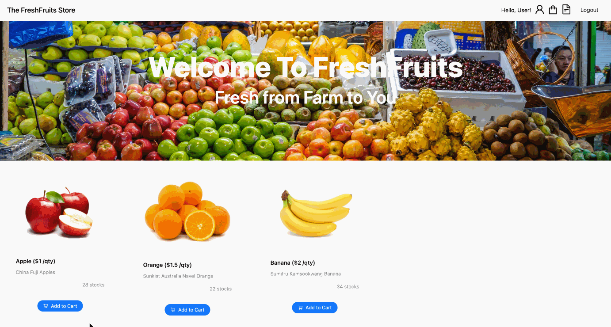
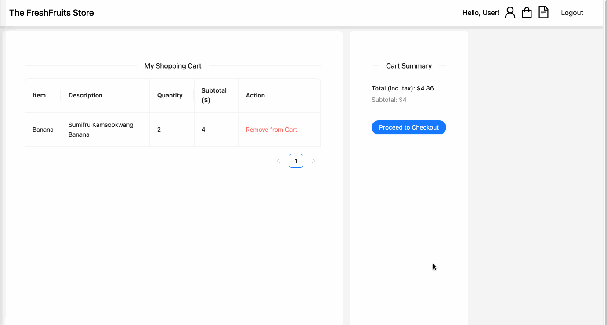
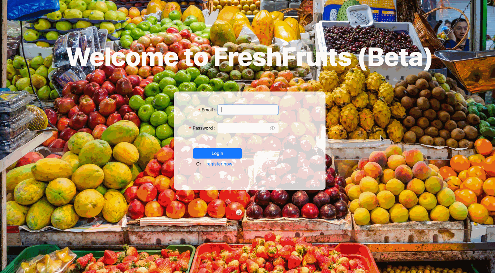
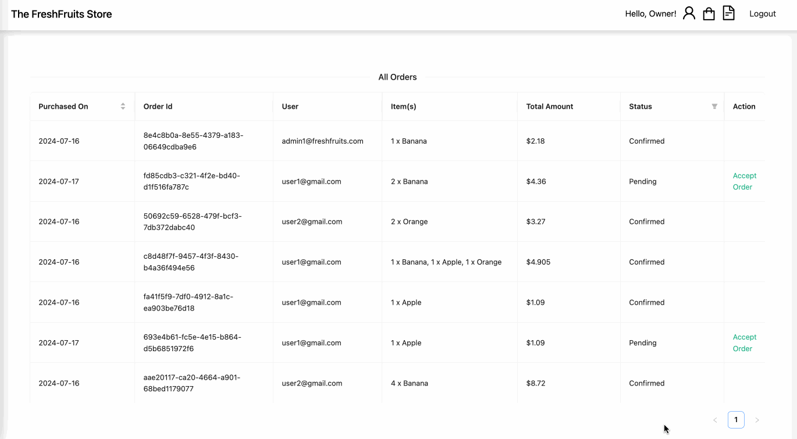
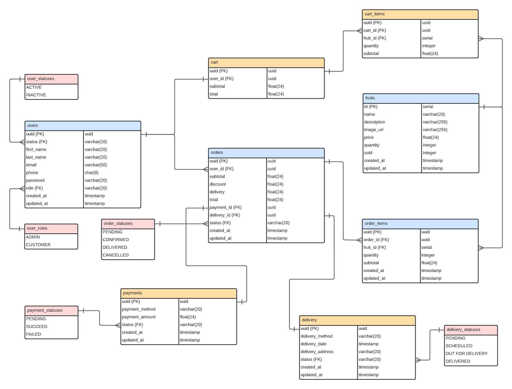

# FreshPOS

FreshPOS is a user-friendly and efficient system designed to streamline sales processes for The FreshFruits Store. An intuitive interface, FreshPOS enables quick and accurate transaction processing, inventory management, and customer tracking. The application supports multiple payment methods, and seamless integration with our inventory system, ensuring that stock levels are always up to date. Enhance your shopping experience with faster checkouts, all powered by the FreshPOS application.

## User Access

#1 As a customer, I want to see a list of fruits that are available to buy (complete with stock and pricing information), so that I can decide which fruits I want to buy.


#2 As a customer, I want to keep track of the fruits and quantity that I have shortlisted (including the total amount I need to pay), so that I can adjust my purchasing decisions as I shop.




#3 As a customer, I want to submit my order of the fruits I selected, so that I can complete my purchase when I am done shopping. Assume that payment is done separate from this POS application.



(Optional) As a customer, I want to be able to log in and see my order history, so that I can track my previous purchases.



## Owner Access

#4 As an owner, I want to see the orders that my customers have submitted, so that I can fulfill their orders.




# Technologies Used
   


# React Hierarchy
<pre>
App
|__ Login
      |__ CreateAccountModal
|__ Home
      |__ FruitCard
|__ Profile
      |__ UpdateProfileModal
|__ Cart
|__ MyOrders
|__ AllOrders
|__ NotFound
</pre>

# Entity Relationship Diagram (ERD)



# Getting Started

### Backend Setup

1. Run `npm init -y` to initialize the project and create a package.json file
2. Install all the packages and dependencies <br />
<pre>
  npm i express
  npm i -D nodemon
  npm i express-validator 
  npm i jsonwebtoken uuid bcrypt 
  npm i cors helmet express-rate-limit
  npm i dotenv
  npm i pg
</pre>
4. Create your .env file with the following variables:
```
PORT=5001
ACCESS_SECRET=<YOUR_ACCESS_SECRET>
REFRESH_SECRET=<YOUR_REFRESH_SECRET>
DB_USER=<YOUR_DB_USER>
DB_PASSWORD=<YOUR_DB_PASSWORD>
```

### Frontend Setup

1. Run `npm i` to install all the dependencies
2. Run `npm i react-router-dom` to install react-router-dom
3. Run `npm I antd --save` to install Ant Design
4. Run `npm i jwt-decode` to install jwt-decode
5. Create your .env file with the following variables:
`VITE_SERVER=http://localhost:5001`


# References
1. [Ant Design](https://ant.design/components/overview/)
2. ChatGPT 3.5
